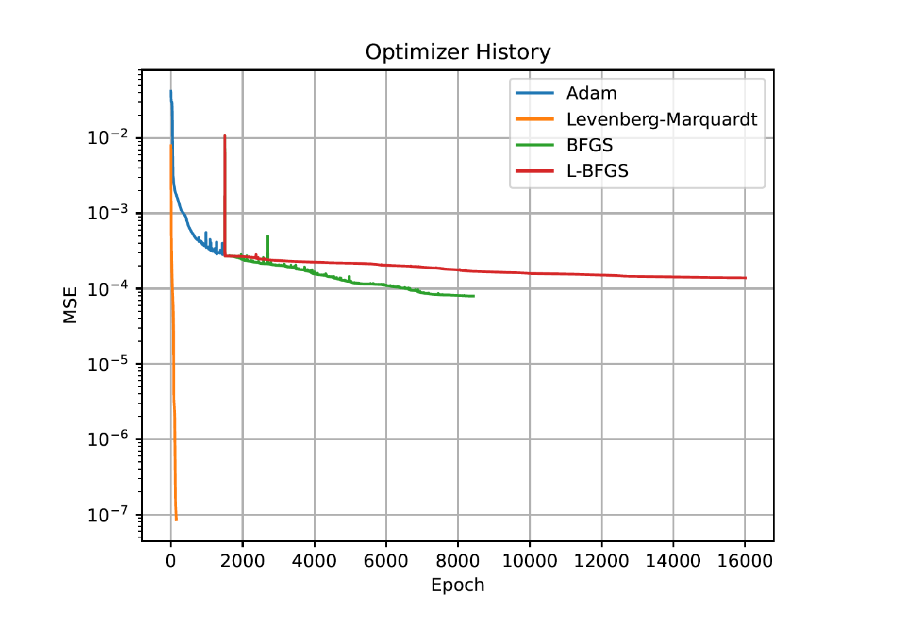
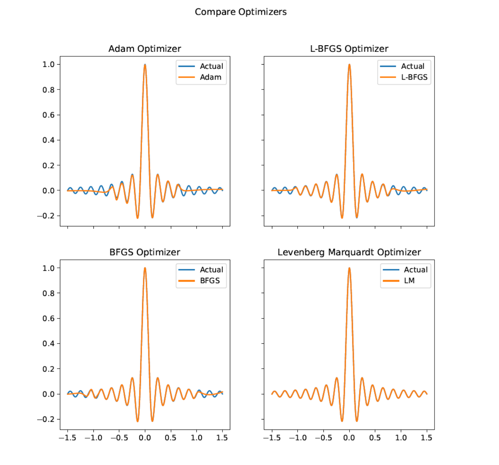
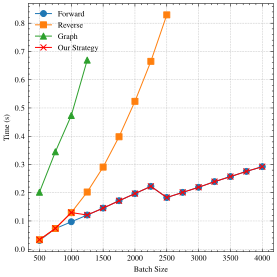
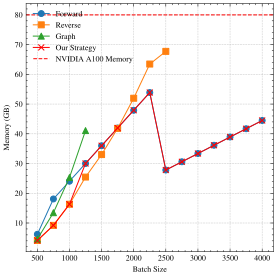

cuPyLMA: a Multi-GPU Levenberg-Marquardt (Deep Learning) Optimizer Powered by NVIDIA cuPyNumeric
=======================================

cuPyLMA is a scalable multi-GPU (deep learning) optimizer that implements the [Levenberg-Marquardt algorithm (LMA)](https://en.wikipedia.org/wiki/Levenberg%E2%80%93Marquardt_algorithm). This library is built on PyTorch and powered by [NVIDIA cuPyNumeric](https://github.com/nv-legate/cupynumeric) (a NumPy-like scientific computing framework).

## Background
The [Levenberg-Marquardt algorithm (LMA)](https://en.wikipedia.org/wiki/Levenberg%E2%80%93Marquardt_algorithm) is a second-order optimizer. It solves parameter updates $\mathbf{v}$ from the equation involving the Jacobian matrix $\mathbf{J}$ of the batched outputs with respect to model parameters, and the residuals $\mathbf{r}$.

$$
\large (\mathbf{J}^T\mathbf{J}+\lambda \mathbf{I})\mathbf{v} = \mathbf{J}^Tr
$$

The Jacobian matrix requires large computation and memory space. To resolve them, we take advantage of [NVIDIA cuPyNumeric](https://github.com/nv-legate/cupynumeric). This NumPy-like scientific computing framework automatically distributes the Jacobian matrix and schedules computation to multiple GPUs.

## Features
* cuPyLMA utilizes LMA as the optimizer, which can converge to a lower loss in a shorter time than the Adam optimizer.
    <p float="left">
    
    
    </p>

* cuPyLMA explicityly computes the Jacobian matrix required by LMA, which boosts the performance while sacrificing the memory space. This is different from most LMA implementations which utilizes the [preconditioned conjugate gradient solver (PCG)](https://en.wikipedia.org/wiki/Conjugate_gradient_method).
* cuPyLMA reduces the computation cost and the peak memory usage of the Jacobian matrix computation by selecting the best strategy. 
    <p float="left">
    
    
    </p>
* cuPyLMA scalably solves LMA parameter updates via cuPyNumeric.
* cuPyLMA reduces the number of hyperparameter tuning. All we need to tune is the batch size.

## Install
### Pip
```bash
pip install cuPyLMA
```

## Usage
See [curve fitting example]().

## References
[1] [fabiodimarco/torch-levenberg-marquardt](https://github.com/fabiodimarco/torch-levenberg-marquardt): Our base code refers to the repository.

[2] H. P. Gavin, “The Levenberg-Marquardt algorithm for nonlinear least squares curve-fitting problems,” 2024.: It provides theoretical explanation of LMA.


## Citation
J. Taylor, W. Wang, B. Bala, and T. Bednarz, “Optimizing the optimizer for data driven deep neural networks and physics informed neural networks,” May 16, 2022, arXiv: arXiv:2205.07430. doi: 10.48550/arXiv.2205.07430.
